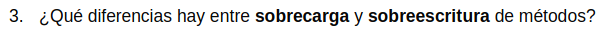
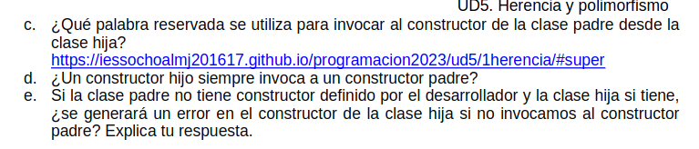
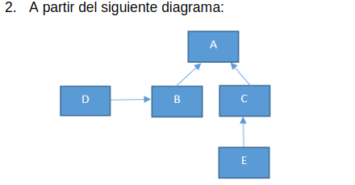

# UD6T1Herencia 
## Juan Sebastian Franco 1K DAM

---

    a. Si, una clase hija hereda tantos atributos como metodos del padre.
    b. La palabra reservada es "super()"
    c. Si, siempre se llama al contructor padre.
    d. No, porque se llamara al padre el cual esta por defecto, por tanto no da error
    y funciona sin problema.

---

    a. La clase A es una MADRE de la clase C.
    b. La clase B es una HERMANA de la clase C.
    c. La clase E es una NIETA de la clase A.
    d. La clase D es una HIJA de la clase B.
    e. La clase A es una ABUELA de la clase D.

---

    Sobrecarga: La sobrecarga de metodos es el crear un mismo constructor con mismos    
    metodos pero añadiendo distintos luego.

    Sobreescritura: La Sobreescritura es cuando una clase hija redifine los parametros 
    de su clase padre.

---

### 4.

    d. No muestra los atributos de director y valoracion del objeto ob2 puesto a que se
    esta haciendo llamado del ToString Tarea1.Video (es decir, el padre de Tarea1.Pelicula) por tanto, 
    este no mostrara los atributos anteriormente mencionados de Tarea1.Pelicula.
    
    e. Habria que sobreescribir el ToString de Video.

    g. 1. Artista, 2. Categoria. 3. y 4.

    h. añadiria precio al padre Video.

---

    a. 

    